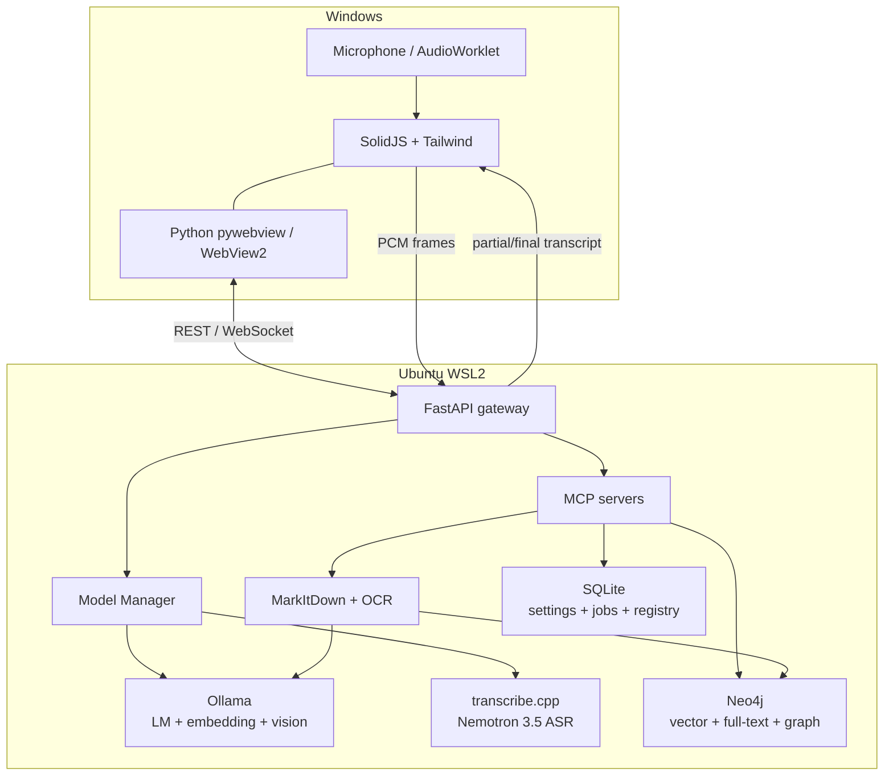

Tôi chốt kiến trúc phù hợp nhất là: giao diện desktop chạy native trên Windows, còn toàn bộ AI runtime chạy trong Ubuntu WSL2. Ollama, Neo4j, GraphRAG và `transcribe.cpp` dùng chung GPU RTX PRO 6000 Blackwell nhưng được điều phối bởi một Python Model Manager.

## 1. Stack đề xuất

| Lớp                | Công nghệ                                                                              |
| ------------------ | -------------------------------------------------------------------------------------- |
| Desktop shell      | Python 3.12 + `pywebview` + Microsoft Edge WebView2                                    |
| Frontend           | SolidJS + TypeScript + Vite + Tailwind CSS 4 + Kobalte                                 |
| API backend        | FastAPI + Uvicorn + Pydantic 2 + HTTPX                                                 |
| Realtime           | WebSocket nhị phân cho audio và transcript; SSE/WebSocket cho tiến trình tải model     |
| LLM/embedding      | Ollama native trong WSL2                                                               |
| MCP                | Official MCP Python SDK v2, Streamable HTTP                                            |
| Document ingestion | MarkItDown + `markitdown-ocr` + OCRmyPDF/PaddleOCR fallback                            |
| Vector/GraphRAG    | Neo4j + `neo4j-graphrag`                                                               |
| Memory             | SQLite cho dữ liệu chuẩn + Neo4j vector index cho semantic memory                      |
| ASR                | `transcribe.cpp` CUDA + Nemotron 3.5 ASR Streaming 0.6B                                |
| Audio              | Web Audio API/AudioWorklet → WebSocket → soxr → PCM 16 kHz mono                        |
| Background jobs    | Python worker + hàng đợi bền vững trong SQLite; Redis chỉ thêm khi cần concurrency cao |
| Package management | `uv` cho Python, `pnpm` cho frontend                                                   |
| Deployment         | Native WSL services + Docker Compose riêng cho Neo4j                                   |



## 2. Phân chia Windows và WSL

### Trên Windows

Chỉ đặt:

* Python `pywebview`.
* WebView2 Runtime.
* Logic khởi động/dừng WSL.
* File picker, native notification, system tray.
* SolidJS đã build thành static assets.

`pywebview` phù hợp vì nó dùng web technology trong cửa sổ native và có cầu nối hai chiều JavaScript–Python. Tuy nhiên, chỉ nên dùng `window.pywebview.api` cho thao tác desktop như mở file hoặc minimize; dữ liệu AI và streaming nên chạy qua HTTP/WebSocket. [Tài liệu pywebview](https://pywebview.flowrl.com/)

### Trong WSL2

Chạy:

* FastAPI.
* Ollama.
* `transcribe.cpp`.
* Neo4j.
* MCP servers.
* Ingestion/OCR worker.
* Model Manager.

Lưu model và Neo4j data trong filesystem Linux của WSL, ví dụ `/opt/local-ai`, không đặt trong `/mnt/c`, vì I/O trên filesystem được mount từ Windows thường kém hơn.

Với CUDA WSL, chỉ cài NVIDIA RTX Enterprise/Studio Driver trên Windows. Không cài Linux display driver bên trong WSL; NVIDIA cảnh báo driver Windows đã cung cấp `libcuda.so` cho WSL. [NVIDIA CUDA on WSL](https://docs.nvidia.com/cuda/wsl-user-guide/index.html)

## 3. Backend Python

Tôi đề xuất một FastAPI process làm gateway duy nhất:

```text
/services/api
    chat/
    models/
    documents/
    memory/
    audio/
    mcp_gateway/
```

Các dependency chính:

```text
fastapi
uvicorn[standard]
pydantic-settings
httpx
websockets
orjson
sqlalchemy
alembic
neo4j
neo4j-graphrag
mcp>=2,<3
markitdown[all]
markitdown-ocr
openai
huggingface-hub
soxr
soundfile
structlog
```

Frontend không truy cập trực tiếp Ollama, Neo4j hay ASR. Mọi request đi qua FastAPI để kiểm soát:

* Model nào được phép chạy.
* VRAM allocation.
* Permission của MCP tool.
* Memory injection.
* Citation và provenance.
* Hủy generation hoặc transcription.

## 4. MCP nên được thiết kế như thế nào?

Không cần tách thành quá nhiều process ở giai đoạn đầu. Một MCP server Python có thể expose các namespace logic sau:

### Document/RAG

```text
documents.ingest
documents.list
documents.status
documents.search
documents.get_chunk
documents.delete
```

### GraphRAG

```text
graph.search
graph.neighborhood
graph.find_entity
graph.find_relationships
graph.answer
```

Không nên cho LLM chạy Cypher ghi dữ liệu tùy ý. Chỉ expose các query template hoặc read-only Cypher có validation.

### Memory

```text
memory.remember
memory.search
memory.update
memory.forget
memory.list_preferences
```

### Model information

```text
models.list
models.status
models.capabilities
models.select_default
```

Không expose `models.delete` trực tiếp cho agent; thao tác xóa model nên yêu cầu người dùng xác nhận trong UI.

Dùng MCP Streamable HTTP tại `http://127.0.0.1:8010/mcp`. SDK Python hiện hỗ trợ cả stdio và Streamable HTTP; HTTP phù hợp hơn vì server tồn tại lâu và phục vụ nhiều agent/session. [MCP Python SDK](https://py.sdk.modelcontextprotocol.io/) yêu cầu server local kiểm tra `Origin`, có authentication và bind `127.0.0.1`, không bind `0.0.0.0`. [MCP transport security](https://modelcontextprotocol.io/specification/2026-07-28/basic/transports)

## 5. RAG và GraphRAG

Pipeline ingestion:

```text
File
→ SHA-256/deduplicate
→ MarkItDown
→ kiểm tra chất lượng text
→ OCR nếu cần
→ heading-aware chunking
→ Ollama embedding
→ Neo4j vector index
→ entity/relation extraction bằng Ollama
→ tạo knowledge graph
→ cập nhật full-text index
```

Schema khởi đầu:

```text
(:Document)
(:Section)
(:Chunk)
(:Entity)
(:Person)
(:Organization)
(:Concept)
(:Memory)
(:User)
```

Các quan hệ:

```text
(Document)-[:HAS_SECTION]->(Section)
(Section)-[:HAS_CHUNK]->(Chunk)
(Chunk)-[:MENTIONS]->(Entity)
(Entity)-[:RELATED_TO]->(Entity)
(Memory)-[:BELONGS_TO]->(User)
(Memory)-[:DERIVED_FROM]->(Conversation|Document)
```

Retrieval nên kết hợp:

1. Vector search.
2. Full-text search.
3. Reciprocal-rank fusion.
4. Graph expansion 1–2 hop.
5. Local reranking.
6. Trả về context kèm file, trang, section và chunk ID.

`neo4j-graphrag` đã có `VectorRetriever`, `HybridRetriever`, `HybridCypherRetriever` và `Text2Cypher`. [Neo4j GraphRAG retrievers](https://neo4j.com/docs/neo4j-graphrag-python/current/user_guide_rag.html)

Embedding mặc định:

* `qwen3-embedding:4b`: cân bằng tốt cho tài liệu tiếng Việt, tiếng Anh, toán và code.
* `qwen3-embedding:8b`: ưu tiên chất lượng.
* `embeddinggemma`: chế độ nhẹ và nhanh.

Qwen3 Embedding hỗ trợ hơn 100 ngôn ngữ. [Ollama Qwen3 Embedding](https://ollama.com/library/qwen3-embedding)

## 6. MarkItDown và OCR

MarkItDown hiện có plugin `markitdown-ocr`, dùng vision LLM để đọc ảnh nằm trong PDF, DOCX, PPTX và XLSX. [MarkItDown OCR plugin](https://github.com/microsoft/markitdown/blob/main/packages/markitdown-ocr/README.md)

Cấu hình `openai` client trỏ về Ollama OpenAI-compatible endpoint:

```text
http://127.0.0.1:11434/v1
```

Nên có OCR cascade:

1. MarkItDown native extraction.
2. Nếu mật độ ký tự thấp: OCRmyPDF/Tesseract hoặc PaddleOCR.
3. Nếu bảng, công thức, sơ đồ hoặc layout khó: `markitdown-ocr` gọi Ollama vision model.
4. Lưu Markdown, ảnh trang và metadata nguồn.

Không nên phụ thuộc hoàn toàn vào CLI MarkItDown OCR: đã có báo cáo lỗi CLI và PDF nhiều trang. Gọi trực tiếp Python API, pin version và viết integration test cho PDF scan nhiều trang.

## 7. ASR và streaming voice-to-text

Tên đầy đủ nên dùng là `Nemotron 3.5 ASR Streaming 0.6B`. Đây là ASR model riêng, không chạy qua Ollama.

Model hỗ trợ 40 locale, trong đó `vi-VN` thuộc nhóm transcription-ready, có dấu câu, viết hoa, automatic language detection và chunk 80–1120 ms. [NVIDIA model card](https://huggingface.co/nvidia/nemotron-3.5-asr-streaming-0.6b)

`transcribe.cpp` hiện hỗ trợ:

* GGUF.
* CUDA.
* Batch và streaming.
* Nemotron 3.5 ASR.
* Qwen3-ASR và nhiều họ model khác.
* API giữ cache encoder/decoder giữa các chunk.
  [transcribe.cpp](https://github.com/handy-computer/transcribe.cpp)

Luồng audio khuyến nghị:

```text
getUserMedia
→ AudioWorklet: frame 20–40 ms
→ binary WebSocket
→ jitter/ring buffer
→ resample 48 kHz → 16 kHz mono bằng soxr
→ VAD
→ transcribe_stream_feed()
→ partial transcript
→ endpoint detection
→ final transcript
```

Không nên gọi executable `transcribe-cli` lại cho từng chunk. Hãy:

* Build `transcribe.cpp` thành shared library.
* Tạo binding bằng pybind11, hoặc
* Viết ASR sidecar C++ giữ model/cache trong VRAM và giao tiếp với FastAPI qua Unix socket.

FFmpeg dùng cho:

* Chuẩn hóa file audio/video upload.
* Tách audio từ video.
* Resample batch.
* Khôi phục stream lỗi.

Không nên dùng FFmpeg làm transport chính cho microphone realtime vì AudioWorklet + binary WebSocket có latency và backpressure dễ kiểm soát hơn.

Cấu hình khởi đầu:

```text
language = vi-VN
chunk = 320 ms
input = PCM float32 hoặc int16, 16 kHz, mono
partial interval = 80–160 ms
VAD hangover = 300–500 ms
```

## 8. Model Management UI

Ba adapter dùng chung một interface:

| Loại      | Runtime        | Pull               | Load/warm                   | Unload                       | Delete                |
| --------- | -------------- | ------------------ | --------------------------- | ---------------------------- | --------------------- |
| LM        | Ollama         | `/api/pull`        | `/api/chat` + `keep_alive`  | `keep_alive=0`               | `/api/delete`         |
| Embedding | Ollama         | `/api/pull`        | `/api/embed` + `keep_alive` | `/api/embed`, `keep_alive=0` | `/api/delete`         |
| ASR       | transcribe.cpp | HF/GGUF downloader | Load ASR process            | Release ASR context/process  | Xóa file sau xác nhận |

Ollama cung cấp API để liệt kê model, model đang nằm trong VRAM, pull streaming và delete. [List models](https://docs.ollama.com/api/tags), [running models](https://docs.ollama.com/api/ps), [pull model](https://docs.ollama.com/api/pull), [delete model](https://docs.ollama.com/api/delete)

UI nên có:

* Installed / downloading / validating / loaded / unloaded / failed.
* Loại model: LM, embedding, OCR vision, ASR.
* Kích thước disk và VRAM.
* Quantization.
* Default model cho từng tác vụ.
* Pull progress và cancel.
* SHA-256 integrity.
* Load, unload, update, delete.
* GPU temperature/utilization/VRAM.
* Lịch sử lỗi.

Quan trọng: tạo một `GpuLeaseManager`. Embedding và Nemotron 0.6B có thể thường trú; LM lớn được load/unload theo `keep_alive`. Model Manager phải tránh để Ollama tự chiếm gần hết 96 GB rồi mới khởi động ASR.

## 9. Memory cá nhân hóa

Chia memory thành ba loại:

* `preference`: ngôn ngữ, cách trình bày, model mặc định.
* `fact`: thông tin người dùng đã xác nhận.
* `episodic`: tóm tắt một phiên hoặc dự án.

SQLite giữ bản ghi chuẩn:

```text
id, user_id, type, content, source,
confidence, created_at, updated_at,
expires_at, enabled
```

Neo4j chỉ giữ representation để semantic search và liên kết với dự án/tài liệu.

Quy tắc hợp lý:

* Sở thích người dùng nói rõ: lưu trực tiếp.
* Suy luận từ hành vi: lưu dạng candidate.
* Thông tin nhạy cảm: không tự động lưu.
* Mỗi prompt chỉ retrieve top-k memory liên quan.
* UI phải cho xem, sửa, disable, export và forget.
* Mọi memory đều có provenance.

## 10. Cấu trúc repository

```text
local-ai-desktop/
├── apps/
│   ├── desktop-win/       # pywebview launcher
│   └── web/               # SolidJS + Vite + Tailwind
├── services/
│   ├── api/               # FastAPI
│   ├── mcp/               # MCP tools/resources
│   ├── ingestion/         # MarkItDown/OCR
│   ├── model_manager/
│   └── asr_gateway/
├── packages/
│   ├── domain/
│   ├── ollama_client/
│   ├── graph_store/
│   └── memory/
├── native/
│   └── transcribe_binding/
└── infra/
    ├── compose.yaml       # Neo4j
    └── systemd/
```

Thứ tự triển khai tốt nhất là: nền WSL/Ollama → Model Manager → streaming ASR → RAG → GraphRAG → memory → đóng gói pywebview. Kiến trúc này đủ gọn cho một máy cá nhân nhưng vẫn cho phép sau này tách Neo4j, ASR hoặc MCP thành service độc lập.
