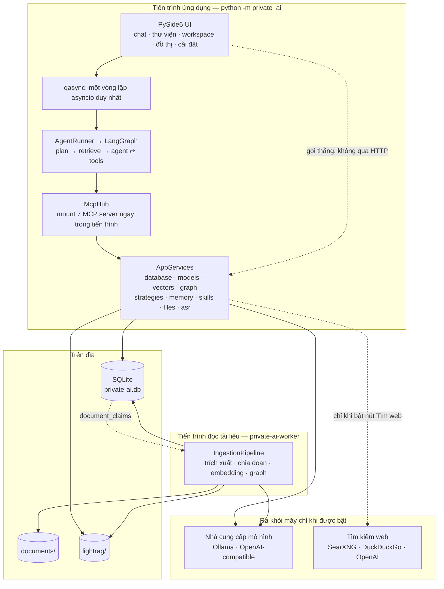

# Private AI

Trợ lý AI chạy hoàn toàn trên máy người dùng: một ứng dụng desktop PySide6, một tiến trình
đọc tài liệu, và không có gì ở giữa. Mô hình, tài liệu, bộ nhớ cá nhân và chỉ mục tri thức
đều nằm trong `.local-data`.

Bản này là bản viết lại. Kiến trúc cũ (FastAPI + SolidJS + pywebview, nói chuyện với nhau
qua HTTP/SSE trên `127.0.0.1:8000`) đã bị bỏ hẳn. Không còn uvicorn, không còn pnpm, không
còn WebView2, không còn `/api/v1`.

## Kiến trúc



Ba quyết định định hình toàn bộ phần còn lại.

**Một tiến trình, gọi thẳng.** UI sở hữu vòng lặp asyncio qua `qasync` và gọi thẳng vào
tầng dịch vụ: `services.agent.stream(...)`, `services.ingestion.add_file(...)`,
`private_ai.core.repositories.*`. Không có `fetch`, không có bộ phân tích SSE, không có
CORS, không có cổng nào phải mở. Cái mất đi là khả năng chạy giao diện trên máy khác; cái
được là mỗi lượt chat bớt một chặng serialize và toàn bộ tầng xử lý lỗi HTTP biến mất.

**Tiến trình đọc tài liệu vẫn tách riêng.** Không phải vì ranh giới mạng mà vì GIL:
markitdown và pypdf parse bằng Python thuần, splitter chia đoạn bằng Python thuần, LightRAG
merge đồ thị bằng Python thuần — tất cả giữ GIL suốt thời gian xử lý một tệp.
`asyncio.to_thread` không cứu được vì thứ bị tranh là GIL chứ không phải thread. Ứng dụng
chỉ ghi `status='queued'`; worker poll hàng đợi đó và giành quyền xử lý qua bảng
`document_claims` (một upsert có điều kiện để giành, heartbeat 10 giây để chứng minh còn
sống, claim im lặng quá 45 giây là của tiến trình đã chết và được phép tiếp quản).

**Toàn bộ tầng AI là LangChain/LangGraph.** Loader, splitter, vector store, memory, chat
model, retriever và vòng lặp agent đều là interface của LangChain. Hai engine được giữ lại
nhưng bọc lại vì LangChain không có thứ tương đương: LightRAG (đồ thị thực thể) nằm sau một
`BaseRetriever`, và OCR bằng LLM thị giác nằm sau một `BaseLoader`.

## Bảy chiến lược truy hồi, mỗi chiến lược một MCP server

Mỗi chiến lược là một đối tượng có `name` và `description`, và `description` chính là đoạn
văn duy nhất mô hình đọc khi quyết định dùng chiến lược nào. Mỗi chiến lược cũng là một MCP
server chạy độc lập được trên stdio, nên một MCP client bên ngoài (hoặc bạn, khi gỡ lỗi) có
thể gọi đúng một chiến lược mà không phải dựng cả ứng dụng.

| Chiến lược | MCP server / tool | Dùng khi |
| --- | --- | --- |
| `vector` | `rag.vector.search` | Người hỏi diễn đạt lại ý bằng từ ngữ của mình; câu hỏi về khái niệm, chủ đề. Không hợp khi cần khớp đúng một tên riêng hay mã số. |
| `keyword` | `rag.keyword.search` | Câu hỏi chứa tên riêng, số hiệu văn bản, tên hàm/biến, hoặc một cụm đặt trong ngoặc kép cần khớp đúng chữ. |
| `hybrid` | `rag.hybrid.search` | Chưa rõ điều quyết định là cách dùng từ hay ý nghĩa. Chạy cả hai nhánh rồi hợp nhất bằng reciprocal rank fusion. |
| `graph` | `rag.graph.search`, `rag.graph.entities`, `rag.graph.neighborhood` | Câu hỏi nhiều bước về quan hệ giữa các thực thể, chuỗi sự kiện đi qua nhiều tài liệu. Chỉ dùng được với tài liệu đã lập chỉ mục ở chế độ `graph`. |
| `summary` | `rag.summary.outline`, `rag.summary.digest` | Yêu cầu tóm tắt / kể lại **toàn bộ** một tài liệu được gọi tên. Đọc mọi đoạn theo đúng thứ tự nguồn rồi map-reduce, không lấy top-k. Đắt hơn nhiều lần so với tìm kiếm thường. |
| `web` | `rag.web.search` | Cần thông tin thời sự, hoặc chắc chắn tài liệu trong workspace không chứa câu trả lời. |
| `auto` | `rag.auto.search` (trên server `core`) | Mặc định. Chọn một trong các chiến lược trên theo hình dạng câu hỏi. |

`auto` định tuyến bằng luật, không gọi mô hình: hỏi một mô hình nên dùng retriever nào tốn
một vòng round-trip trước khi truy hồi bắt đầu, và cùng một câu hỏi có thể định tuyến hai
kiểu ở hai lượt, khiến một câu trả lời sai trở nên không giải thích được. Thứ tự xét là:
yêu cầu tóm tắt toàn bộ tài liệu → `summary`; câu hỏi về quan hệ giữa các thực thể (cụm từ
quan hệ, hoặc từ hai danh từ riêng trở lên) → `graph`; có cụm trong ngoặc kép hoặc mã/định
danh → `keyword`; còn lại → `hybrid`. Lý do được ghi vào metadata của mọi kết quả
(`routed_by`, `routing_reason`) nên UI hiển thị được vì sao.

Reciprocal rank fusion (`score += 1 / (60 + rank)`) hợp nhất theo **thứ hạng** chứ không
theo điểm. Bản cũ cộng thẳng cosine similarity với số từ khóa trùng — hai thang đo không so
sánh được — nên nhánh nào sinh số lớn hơn thì nhánh đó thắng, và một ngưỡng cứng lặng lẽ vứt
bỏ các kết quả dense đúng với câu hỏi ngắn. Hợp nhất theo thứ hạng bỏ được cả hai vấn đề và
không cần ngưỡng.

### Ranh giới chỉ-đọc

Agent chỉ được đưa các tool không thay đổi và không xóa được gì. Sáu tool
`documents.ingest_text`, `documents.delete`, `memory.remember`, `memory.update`,
`memory.forget`, `models.select_default` vẫn tồn tại cho UI và cho MCP client bên ngoài,
nhưng bị loại khỏi danh sách của agent ở **hai tầng**: khi liệt kê tool, và một lần nữa lúc
gọi sau khi đã đổi tên ngược lại. Lọc ở tầng liệt kê thôi là không đủ, vì một mô hình đoán
được tên đã mã hóa (`documents__delete`) sẽ đi thẳng vào hàm gọi. Tên tool có dấu chấm được
đổi thành `__` vì tên function trên wire format của OpenAI không cho phép dấu chấm.

Trích đoạn tài liệu, kết quả web và dữ liệu đồ thị là **dữ liệu không đáng tin cậy**. Mọi
prompt nhúng chúng đều kèm câu cảnh báo bằng tiếng Việt, và mọi tool truy hồi lặp lại cảnh
báo đó ngay trong phần mô tả của mình — vì mô tả tool là thứ duy nhất mô hình đọc đúng vào
lúc nó quyết định làm gì với đoạn văn bản trả về.

## Skills

Skill là một quy trình được đóng gói sẵn: một thư mục có `SKILL.md` mở đầu bằng khối
frontmatter YAML, phần còn lại là markdown hướng dẫn. Bốn gói dựng sẵn đi kèm ứng dụng
(`tom-tat-tai-lieu`, `truy-van-tri-thuc`, `nghien-cuu-web`, `phan-tich-du-lieu`).

Tiết lộ dần (progressive disclosure) là điểm chính: prompt hệ thống luôn mang **danh sách
tên + mô tả một dòng** của mọi skill đang bật; **toàn văn hướng dẫn** chỉ được chèn vào khi
skill đó được kích hoạt cho lượt hiện tại. Một trăm skill vì thế tốn một trăm dòng tóm tắt,
không phải một trăm tài liệu. Việc chọn skill nào cho một lượt cũng làm bằng trùng lặp từ
khóa, không tốn một lần gọi mô hình.

Skill do người vận hành viết nên nội dung của nó được chèn vào như **chỉ dẫn đáng tin cậy** —
đúng hình ảnh phản chiếu của cảnh báo dành cho trích đoạn tài liệu. Vì vậy không có đường nào
từ ingestion hay retrieval được phép tạo, đặt tên hay sửa một skill.

### Viết một SKILL.md

Đặt thư mục vào `.local-data/skills/<tên-skill>/SKILL.md`, hoặc vào bất kỳ thư mục nào khai
báo trong `PRIVATE_AI_SKILL_PATHS`.

```markdown
---
name: tra-cuu-hop-dong          # bắt buộc dạng chữ thường, số, '.', '-', '_'
title: Tra cứu hợp đồng         # tên hiển thị, mặc định lấy theo name
description: Tìm điều khoản trong hợp đồng và trích dẫn đúng số điều.
version: 1.0.0
tools: [rag.keyword.search, documents.list]   # gợi ý, không phải quyền
strategy: keyword               # chiến lược truy hồi nên dùng
keywords: [hợp đồng, điều khoản, phụ lục]     # tăng khả năng được chọn đúng lượt
---

## Quy trình
1. Tìm điều khoản bằng `rag.keyword.search` với đúng cụm từ người dùng nêu.
2. Nếu không thấy, thử lại bằng `rag.hybrid.search`.
3. Luôn dẫn nguồn theo tên tệp và số điều.
```

`description` và phần thân đều bắt buộc: thiếu một trong hai thì gói bị bỏ qua chứ không làm
hỏng ứng dụng. Các tệp khác trong cùng thư mục (`reference.md`, `scripts/`, `templates/`)
chỉ được **liệt kê** cho mô hình; nó tự mở bằng file tool khi thực sự cần. Một gói của người
dùng trùng `name` với gói dựng sẵn sẽ **thay thế** gói dựng sẵn. Cờ bật/tắt là quyết định của
người dùng và được giữ nguyên qua mỗi lần quét lại; mọi thứ khác của một skill được dựng lại
từ đĩa.

## Yêu cầu

- Python 3.12 trở lên. Môi trường phát triển của bản này là CPython 3.14.
- Ollama nếu muốn dùng mô hình cục bộ, hoặc bất kỳ máy chủ nào nói chuẩn OpenAI API
  (vLLM, LM Studio, LiteLLM, OpenAI…).
- Một mô hình đọc được ảnh nếu cần OCR. Không có thì tài liệu vào trạng thái `needs_ocr` kèm
  lý do, chứ không đoán bừa.
- Git, CMake và FFmpeg nếu dùng voice-to-text; Windows cần Visual Studio Build Tools có C++.

Không cần Node.js. Không cần database server: LightRAG ghi graph/vector/KV bằng file dưới
`.local-data/lightrag`.

## Chạy trên macOS / Linux

```text
python3 -m venv .venv
.venv/bin/python -m pip install -e ".[dev]"
.venv/bin/python tools/dev.py
```

`tools/dev.py` khởi động tiến trình đọc tài liệu rồi mở ứng dụng, giám sát cả hai và tắt cả
cây tiến trình khi một trong hai dừng. Mỗi tiến trình con nằm trong process group riêng nên
không có gì sống sót sau khi bạn Ctrl+C.

```text
.venv/bin/python tools/dev.py --no-worker     # ứng dụng tự đọc tài liệu trong tiến trình
.venv/bin/python tools/dev.py --worker-only   # chỉ chạy worker, bám vào DB đang có
.venv/bin/python tools/dev.py --mcp vector    # chạy riêng một MCP server trên stdio
```

Chạy thẳng không qua script:

```text
.venv/bin/private-ai              # hoặc: .venv/bin/python -m private_ai
.venv/bin/private-ai-worker
```

## Cài đặt và build trên Windows PowerShell

```text
powershell -ExecutionPolicy Bypass -File .\tools\install-windows.ps1
```

Script tạo hoặc cập nhật Conda environment `private-ai`, cài đúng một package
(`pip install --editable .[dev]`), chạy test + lint rồi build wheel vào `dist\python`.

```text
.\tools\install-windows.ps1 -EnvironmentName private-ai-dev -PythonVersion 3.13
.\tools\install-windows.ps1 -SkipChecks
```

Ràng buộc Python 3.12/3.13 của bản cũ tồn tại **chỉ vì** RAG-Anything kéo theo MinerU, mà
MinerU khi đó chưa có wheel cho 3.14. RAG-Anything không còn là dependency của dự án nữa
(danh sách hiện tại: LangChain/LangGraph, PySide6, qasync, mcp, lightrag-hku, markitdown,
pypdf, numpy), nên ràng buộc đó đã được nới lên 3.12–3.14 với mặc định 3.14.

Sau khi cài:

```text
conda run --no-capture-output -n private-ai private-ai
conda run --no-capture-output -n private-ai python tools\dev.py
```

## MCP cho client bên ngoài

Trong ứng dụng, bảy server nội bộ được mount **ngay trong tiến trình** trên đúng bộ
`AppServices` đang chạy — không sinh tiến trình thứ hai, không đi qua mạng, nên bản đóng gói
vẫn hoạt động dù không cổng nào được mở.

Một client MCP bên ngoài kết nối bằng stdio qua console script:

```text
.venv/bin/private-ai-mcp            # core: workspaces, documents, memory, models, files
.venv/bin/private-ai-mcp-vector
.venv/bin/private-ai-mcp-keyword
.venv/bin/private-ai-mcp-hybrid
.venv/bin/private-ai-mcp-graph
.venv/bin/private-ai-mcp-summary
.venv/bin/private-ai-mcp-web
```

Bearer token dùng cho chế độ Streamable HTTP được tạo một lần tại `.local-data/mcp-token`;
tệp này không bao giờ đọc được qua `files.read`. Xóa tài liệu hoặc memory đều đòi
`confirmed=true`.

Ngược lại, ứng dụng cũng gắn được MCP server của bên thứ ba: thêm trong **Cài đặt → MCP**
(ghi vào bảng `mcp_servers`), hoặc qua `PRIVATE_AI_MCP_EXTERNAL_SERVERS` cho bản cài không có
UI. Tool của server ngoài được đặt tiền tố `ext.<tên-server>.` trước khi agent nhìn thấy, nên
không thể trùng tên hay giả dạng một tool nội bộ.

## Cấu hình

Mọi biến trong `.env.example` tương ứng với đúng một trường trong `src/private_ai/config.py`.
Copy thành `.env` để dùng. Ứng dụng, worker và mọi MCP server đọc cùng một object `Settings`.

## Kiểm tra

```text
.venv/bin/python -m pytest
.venv/bin/python -m ruff check src tests tools
```

Lần chạy gần nhất trên macOS/arm64, CPython 3.14.7: **227 test pass, 1 xfail**. Bộ test dùng
mô hình chat giả và embedding giả (đều tất định), nên không cần Ollama và không chạm mạng.
Test xfail duy nhất được mô tả ngay dưới đây.

## Phần chưa hoàn tất

Phần này cố ý liệt kê cả những thứ *chưa được kiểm chứng*, không chỉ những thứ đã biết là
thiếu.

- **Chưa chạy thử end-to-end.** Những gì viết ở trên về luồng chat thật, ingestion thật với
  một PDF thật, OCR, ASR, lập chỉ mục LightRAG và màn hình đồ thị tri thức đều **chưa được
  xác nhận bằng một lần chạy ứng dụng**. Chúng được xác nhận ở mức test đơn vị/tích hợp và
  đọc mã. Cụ thể `python -m private_ai` chưa được mở lên trong đợt này.
- **Ngân sách vòng gọi công cụ lệch một bước với số lẻ.** `agent_config` đặt
  `recursion_limit = agent_max_iterations + 2`, nhưng một lượt dùng hết ngân sách cần
  `plan + retrieve + (2 × số vòng + 1)` superstep. Với `agent_max_iterations` là số **lẻ**
  (3, 5, 7, 9…) con số này thiếu đúng một bước và vòng gọi công cụ cuối cùng bị
  `GraphRecursionError` nuốt mất. Mặc định là 10 (số chẵn) nên bản cài mặc định không bị;
  nhưng cài đặt cho phép chọn 1–64. Đã ghi lại bằng test xfail
  `test_an_odd_iteration_budget_can_use_all_of_its_tool_rounds`.
- **Windows chưa được kiểm chứng.** `tools/install-windows.ps1` đã được viết lại nhưng chưa
  chạy trên máy Windows, và cũng chưa được kiểm tra cú pháp bằng PowerShell. Cụ thể hơn:
  toàn bộ dependency đã được xác nhận cài và chạy dưới CPython 3.14 trên macOS/arm64, nhưng
  **wheel cp314 trên Windows cho PySide6 và lightrag-hku thì chưa** — nếu thiếu, dùng
  `-PythonVersion 3.13`.
- **Chưa có ASR streaming hoàn chỉnh.** Khung 320 ms PCM float32 mono 16 kHz và bước flush
  vẫn được giữ từ bản cũ, nhưng chưa có VAD/endpoint detector riêng hay jitter buffer thích
  nghi.
- **Thanh GPU** phản ánh reservation và inventory từ nhà cung cấp, chưa đọc temperature hay
  utilization phần cứng. Hai tiến trình cùng load model đúng một thời điểm vẫn còn khe race
  vì chưa có distributed lock.
- **Màn hình đồ thị tri thức** được dựng lại trên `QGraphicsView` với force layout tự viết
  thay cho Cytoscape.js. Hành vi đã port (gộp dần khi mở rộng node, bung lân cận theo vòng
  tròn, cỡ node theo bậc, spotlight khi hover) chưa được so sánh trực quan với bản cũ.
- **System tray và native notification** của Windows chưa được triển khai.
